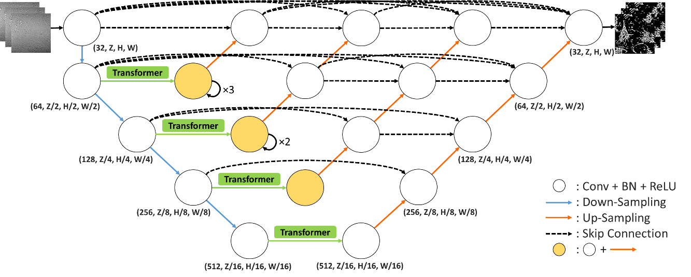

# DenT: Dense-Transformer for 3D Biomedical Image Segmentation



## Requirements

All of the processes are trained on Taiwan Computing Cloud (TWCC) and with an NVIDIA graphics card (NVIDIA V100). It is recommended to install latest drivers and use the GPU with 24+ GB of RAM.

## Environment setup

- Recommend: Install [Miniconda](https://conda.io/miniconda.html) for environment control.
- Create a Conda environment for the platform:

    ```shell
    python=3.10
    torch=1.13.1+cu116
    ```

## Data

1. Data is currently available [here](https://drive.google.com/drive/folders/10LJxPudM3GWgYvN6Rz-DhLWFRMt4WJLD?usp=sharing)
2. Create a new directory `DenT` under `./data/`, and put the Data to `./data/DenT/`

- If you want to train with your own data, please put your dataset `***` inside `./data/`. target dataset and source dataset should be named as `./data/***/train/target`and`./data/***/train/source`.
- Create your own testing set and validation set by running the following script:

    ```shell
    python split_data.py
    ```

- you should now see 3 folders inside the `./data/***` (train, test, val), each consists of the folder `target` and `source`.

## Results

1. Download the results from [here](https://gofile.me/7472U/P7jboFktj)
2. Move the `checkpoints` directory according to the structure of `./results`, `./results` is used to store the training results and as a variable `result_root` introduced in the next section (`result_root = ./results`)

## Train

1. Open `./script/train.sh`, and find the section below

    ```bash
    # variables
    target="target" # options: target / target_dna
    model="CusDenT" # options: (DenT) DenT, CusDenT(revision)
    data_root="../data"
    result_root="../results"
    ```

2. Modify `target` and `model` variables (`--random_seed` and `--use_multiheads` are the arguments for `CusDenT`)
3. Go to `Line 5` and replace the environment name

    ```bash
    conda activate "[your environment]"
    ```

4. Run `train.sh`

    ```shell
    cd script
    bash train.sh
    ```

5. After the training progress, you should see the `result_dir` looks like the following structure

    ```txt
    results/[target]/[model]_[target]_3D_15725_[num]
     |
     | --- checkpoints
     |  | --- model_CusDenT_[n]_pth.tar
     |  | --- ...
     |  | --- model_CusDenT_best_pth.tar
     |
     | --- seg_results (empty)
     | --- [datetime]_args.toml
     | --- events.out.tfevents
    ```

- If your data is on the other place, you should modify `data_root` to redirect to the files
- To save the results to the other place, please change `result_root`

## Predict the structures with the trained model

1. Open `./script/test.sh`, and find the section below

    ```bash
    # variables
    target="target" # options: target / target_dna
    model="CusDenT" # options: (DenT) DenT, CusDenT(revision)
    data_root="../data"
    result_root="../results"
    record_dir="CusDenT_target_3D_15725_1" # change result dir
    ```

2. Modify `record_dir`, `target` and `model` variables

   - `record_dir` should be `[model]_[target]_3D_15725_[num]`
   - `target` and `model` should match to `record_dir`

3. Go to `Line 5` and replace the environment name

    ```bash
    conda activate "[your environment]"
    ```

4. Run `test.sh`

    ```shell
    cd script
    bash test.sh
    ```

5. After the process, you can find that predict images is generated in `seg_results/` directory under `[model]_[target]_3D_15725_[num]/`

## Training Progress visualization

If `tensorboard` is installed, you can see the training progress with following actions

```shell
cd results
tensorboard --logdir . --port [port_num]
```

## Evaluate Model Performance

1. Open `./script/calcu_score.sh`, and find the section below

    ```bash
    # variables
    target="target" # options: target / target_dna
    model="CusDenT" # options: (DenT) DenT, CusDenT(revision)
    data_root="../data"
    result_root="../results"
    record_dir="CusDenT_target_3D_15725_1" # change result dir
    ```

2. Set variables as same as those in `test.sh`
3. Go to `Line 5` and replace the environment name

    ```bash
    conda activate "[your environment]"
    ```

4. Run `calcu_score.sh`

    ```shell
    cd script
    bash calcu_score.sh
    ```

5. Checkout the score

    ```shell
    ============================================================
    |- class #0 : 0.92224
    |- class #1 : 0.44280
    |--> mean_iou: 0.682518

    |- class #0 : 0.95955
    |- class #1 : 0.61381 <--- Dice score of [target]
    |--> mean_dice: 0.786676
    ```

## Reference

- [Google ViT](https://github.com/google-research/vision_transformer)
- [TransUNet](https://github.com/Beckschen/TransUNet)

## Citations

```bibtex
```
